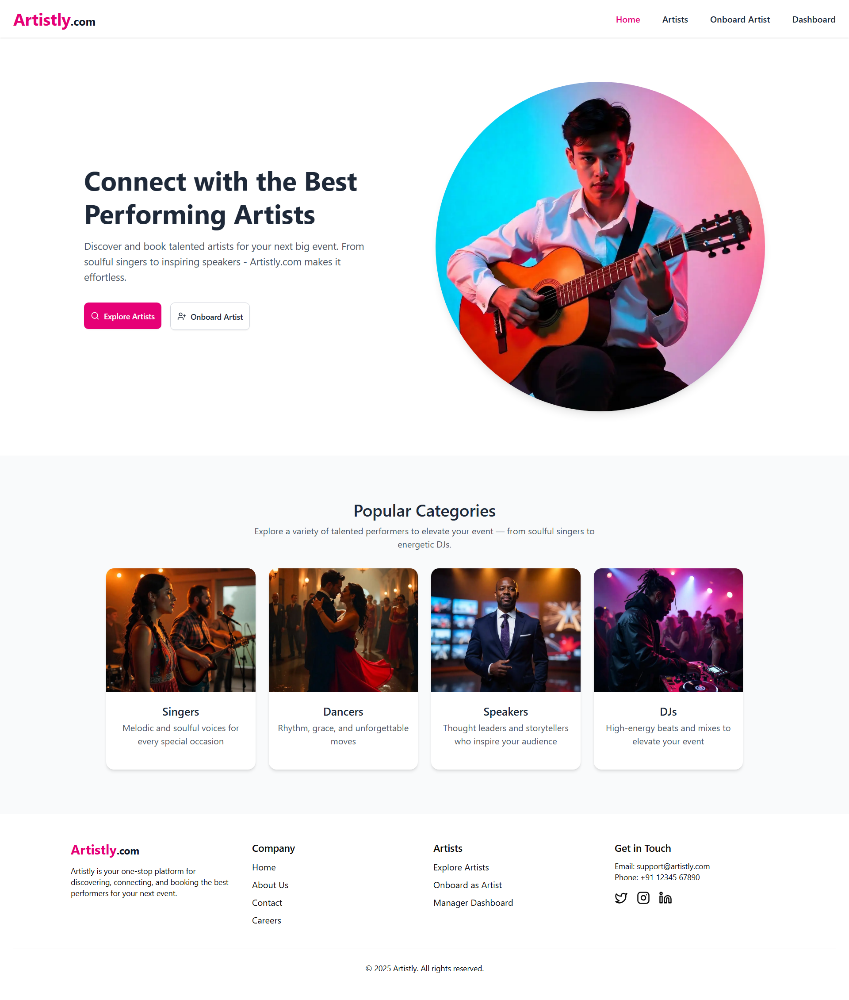
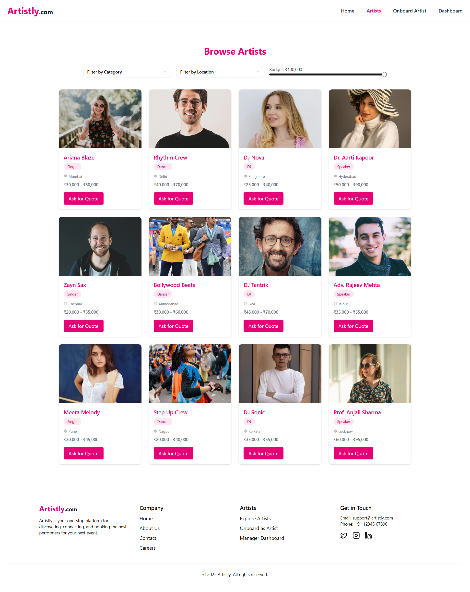
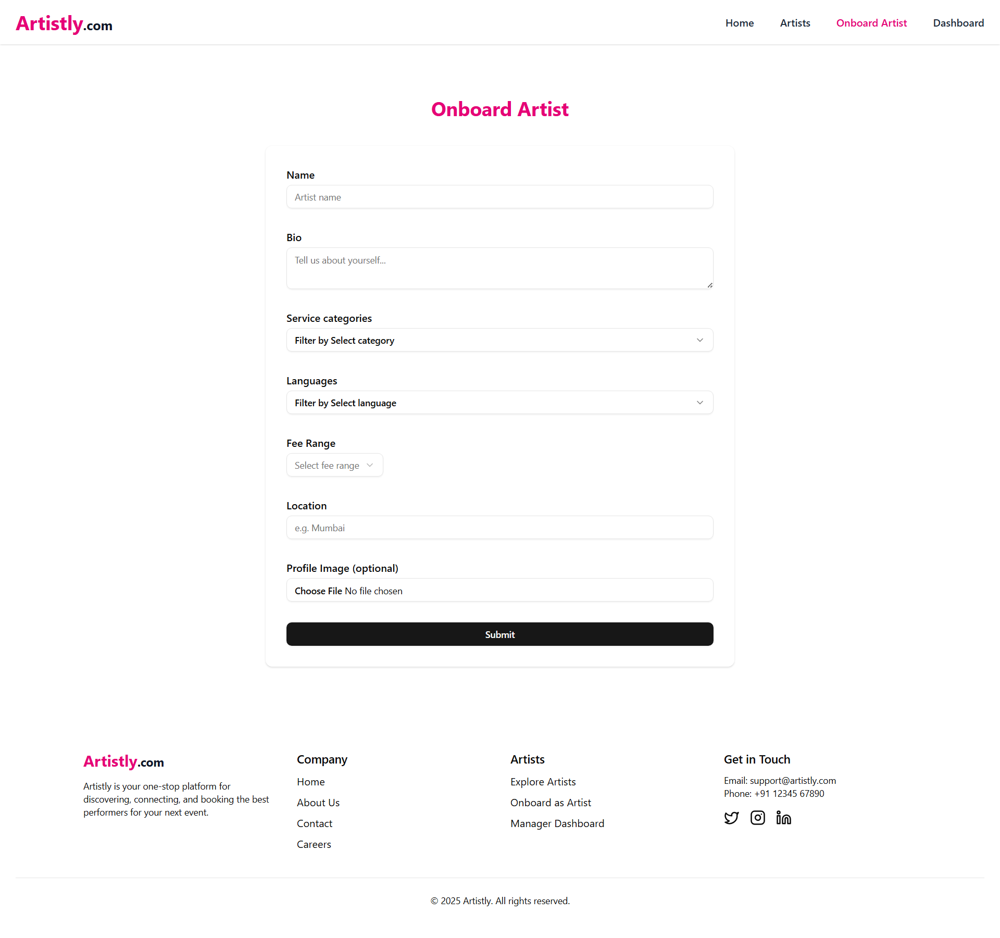
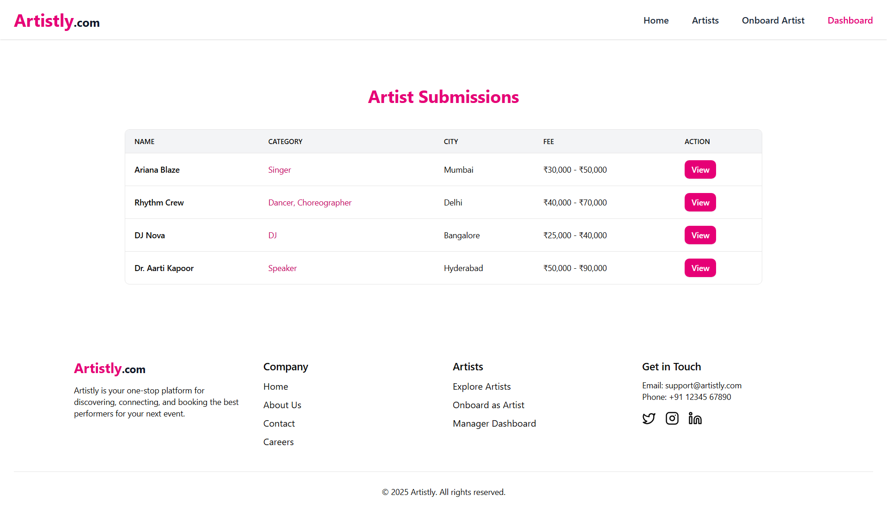

# 🎭 Artistly – Event Talent Discovery Platform

Artistly is a modern talent discovery platform built with **Next.js 15** and **ShadCN UI**, designed to help users discover and book performing artists effortlessly. It includes a hero-driven homepage, searchable artist listings with filters, onboarding forms for artists, and a manager dashboard for submissions.

---

## 🚀 Features

- 🖼️ **Home Page** with hero section and category cards  
- 🔎 **Artist Directory** with category/location/price filters  
- 📝 **Artist Onboarding Form** with validation and file upload  
- 📊 **Dashboard View** with artist submission table  
- ✅ Fully responsive & styled with **Tailwind CSS** + **ShadCN UI**

---

## 🛠️ Tech Stack

- [Next.js 14](https://nextjs.org/)
- [React 18](https://react.dev/)
- [Tailwind CSS](https://tailwindcss.com/)
- [ShadCN UI](https://ui.shadcn.com/)
- [Formik + Yup](https://formik.org/)
- Local mock data for artists and submissions

---

## 📸 Screenshots

### 🏠 Home Page


---

### 🔍 Artists Page


---

### 🧑‍🎤 Onboard Artist


---

### 📋 Dashboard


---

## 📦 Installation & Running

```bash
# 1. Clone the repo
git clone https://github.com/tanmayvaij/artistly.git
cd artistly

# 2. Install dependencies
npm install

# 3. Run the development server
npm run dev
